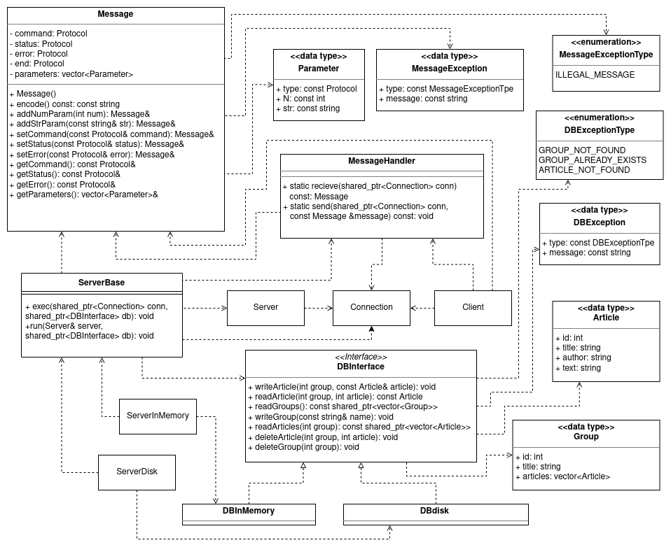

# NewsServer

A simple single threaded news server that communicates with the client using a simple protocol.

## About

The server can handle multiple connections. There are two types of servers. Executable "serverinmemory" is an in memory server while "serverdisk" on the other hand uses a filesystem. The interactions with the two different types of databases are defined in the "dbinterface.h" interface. The databases themselves are implemented in "dbdisk.cc" and "dbinmemory.cc". The message handler is denined in "messagehandler.h". This class takes in a connection and handles all communication with a very high abstraction level. It can "recieve" incomming packages and "sendRequest" send requests to the server.

### UML



## Installation

Run the following commands from here or inside the src directory. The executables will be generated in the "build" directory, inside their own subdirectories and then copied over to the "bin" directory.

```bash
make
make install
```

## Usage

Will be updated.

```bash

```

## Project Structure

```bash
.
├── bin
├── src
│   ├── build
│   │   ├── client
│   │   │   ├── client.cc
│   │   │   └── Makefile
│   │   ├── server
│   │   │   ├── Makefile
│   │   │   ├── serverbase.h
│   │   │   ├── serverdisk.cc
│   │   │   └── serverinmemory.cc
│   │   └── Makefile
│   ├── libclientserver
│   │   ├── connection.cc
│   │   ├── connectionclosedexception.h
│   │   ├── connection.h
│   │   ├── dbdisk.cc
│   │   ├── dbdisk.h
│   │   ├── dbinmemory.cc
│   │   ├── dbinmemory.h
│   │   ├── dbinterface.h
│   │   ├── Makefile
│   │   ├── messagehandler.cc
│   │   ├── messagehandler.h
│   │   ├── protocol.h
│   │   ├── server.cc
│   │   └── server.h
│   ├── test
│   │   ├── Makefile
│   │   ├── myclient.cc
│   │   └── myserver.cc
│   └── Makefile
├── Makefile
├── README.md
└── UMLCPP.png
```
